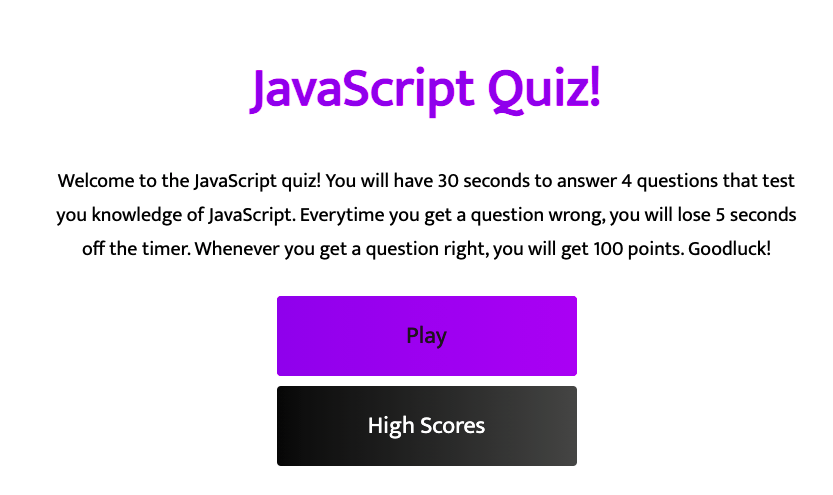

# Homework 4: WebAPIs - Quiz Game

## Instructions

```
1. Click "Start game"
2. Try to answer the 4 quiz questions within 30 seconds 
3. Each one you answer incorrectly will deduct 5 seconds from your remaining time
4. Once you are either done answering all 4 questions or run out of time you will be prompted to enter your name for the score board
5. You can keep track of your top score on the score board
```

## User Story

```
AS A coding boot camp student
I WANT to take a timed quiz on JavaScript fundamentals that stores high scores
SO THAT I can gauge my progress compared to my peers
```

## Acceptance Criteria

```
GIVEN I am taking a code quiz
WHEN I click the start button
THEN a timer starts and I am presented with a question
WHEN I answer a question
THEN I am presented with another question
WHEN I answer a question incorrectly
THEN time is subtracted from the clock
WHEN all questions are answered or the timer reaches 0
THEN the game is over
WHEN the game is over
THEN I can save my initials and my score
```

## Mock-Up



Deployed link: https://mackenzielc.github.io/homework-4/ 